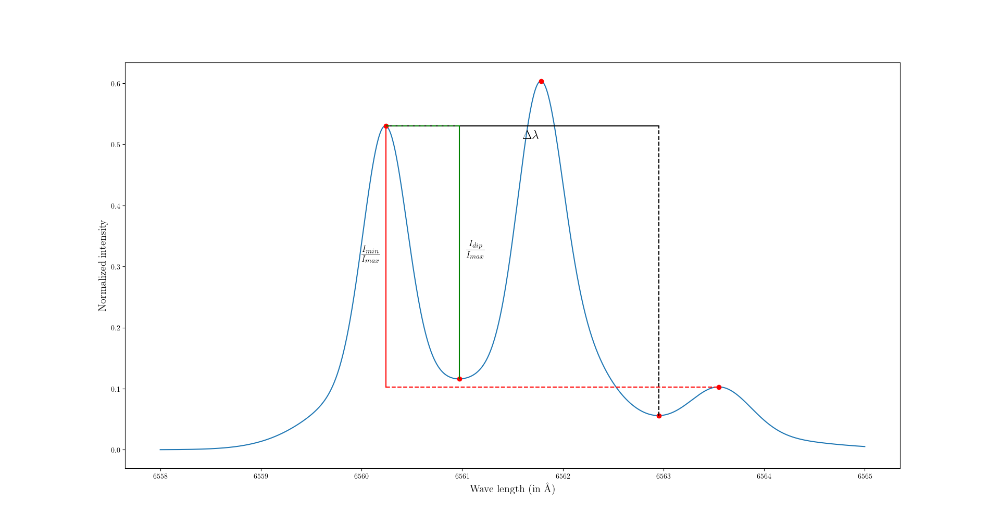

# Poly Gaussian

## Goal

The Goal of this repository is to make a code able to determine the percentage of hydrogen in a divertor of a tokamak using the balmer-alpha ray of hydrogen and deuterium.

## Working of main.py

main.py is the original approach of this problem and is now unmaintained and out of date. This approach idea was to feed sum of multiple gaussian (hence the name of the repository) close to what a spectrum would be. And from this to predict the individual spectrum of hydrogen and deuterium. But this approach lead to poor result and rather expensive computation.

## Working of new_main.py

new_main.py is the new approach, currently maintained. This approach idea is to feed processed data from the spectrum to the algorithm. the difference of wave length between the dip of the hydrogen and the max of the deuterium. The ratio between the dip of deuterium and the max of deuterium. And the ratio between the max of Hydrogen and the max of deuterium.

